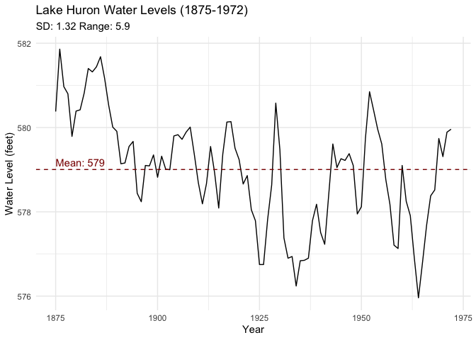

Assignment B1
================
Maddy Riddler

- [Assignment Overview](#assignment-overview)
  - [Creating a Function](#creating-a-function)
  - [Examples of my Function](#examples-of-my-function)
    - [Example 1](#example-1)
    - [Example 2](#example-2)
  - [Test the Function](#test-the-function)
    - [Test 1](#test-1)
    - [Test 2](#test-2)
    - [Test 3](#test-3)

# Assignment Overview

> This is my R Markdown document for the STATS 545B assignment B1. In
> this document, my goal is to create and fortify a new function. I will
> document the function and include examples. Finally, I will test the
> function. Thanks for reading!

## Creating a Function

> I found it very useful in for my STATS 545A assignments to summarize
> some common statistical values for a variable before continuing with
> further analyses. Thus, I decided to create a function that returns
> several common statistical values for all numerical variables in a
> data set.

``` r
quick_stats <- function(data, na.rm = TRUE) {
  if (!is.data.frame(data)) {
    stop("Input must be a data frame.")
  }
  
  numeric_data <- data %>% select(where(is.numeric))

  if (ncol(numeric_data) == 0) {
    message("No numeric columns found")
    return(NULL)
  }

  result <- numeric_data %>%
    summarise(across(everything(), 
                     list(
                       mean = ~mean(., na.rm = TRUE),
                       sd = ~sd(., na.rm = TRUE),
                       median = ~median(., na.rm = TRUE),
                       mode = ~as.numeric(names(which.max(table(., useNA = "no")))),
                       range = ~diff(range(., na.rm = TRUE))
                     )
    )) %>%
    pivot_longer(cols = everything(),
                 names_to = c("variable", ".value"),
                 names_pattern = "(.*)_(.*)") %>%
    select(variable, everything())
  
  return(result)
}

#' @title Calculate Summary Statistics for a Data Set
#'
#' This function quickly calculates useful summary statistics for all numeric
#' variables in a data frame, including handling of missing values.
#'
#' @param data This parameter needs a data frame containing the variables to be analysed, thus "data" indicates to the user that this parameter is asking where the function can find the variables to be analysed (i.e., their data set)
#' @param na.rm Logical; if TRUE (default), NA values are removed before calculations.
#'
#' @return A tibble with the following summary statistics for each numerical value:
#' \itemize{
#'   \item mean: Mean of the variables
#'   \item sd: Standard deviation of the variables
#'   \item median: Median value of the variables
#'   \item mode: Most frequent value in the variables
#'   \item range: Difference between the maximum and minimum values
#' }
```

## Examples of my Function

> Let’s see how my function works! These examples will utilize built-in
> R data sets that do not require a specific working directory.

### Example 1

> Say we are interested in getting a general idea about the mtcars data
> set. We can use the quick_stats() function to quickly see some
> important statistical values for all the numerical variables!

``` r
quick_stats(mtcars)
```

    ## # A tibble: 11 × 6
    ##    variable    mean      sd median   mode  range
    ##    <chr>      <dbl>   <dbl>  <dbl>  <dbl>  <dbl>
    ##  1 mpg       20.1     6.03   19.2   10.4   23.5 
    ##  2 cyl        6.19    1.79    6      8      4   
    ##  3 disp     231.    124.    196.   276.   401.  
    ##  4 hp       147.     68.6   123    110    283   
    ##  5 drat       3.60    0.535   3.70   3.07   2.17
    ##  6 wt         3.22    0.978   3.32   3.44   3.91
    ##  7 qsec      17.8     1.79   17.7   17.0    8.4 
    ##  8 vs         0.438   0.504   0      0      1   
    ##  9 am         0.406   0.499   0      0      1   
    ## 10 gear       3.69    0.738   4      3      2   
    ## 11 carb       2.81    1.62    2      2      7

### Example 2

> Consider the Lake Huron data set.

``` r
glimpse(LakeHuron)
```

    ##  Time-Series [1:98] from 1875 to 1972: 580 582 581 581 580 ...

> We can convert the time series data into a data frame that
> quick_stats() can handle. After we have our data frame we can filter
> for the water level variable.

``` r
lake_huron_df <- data.frame(
  year = as.numeric(time(LakeHuron)),
  level = as.vector(LakeHuron)
)

lake_huron_stats <- quick_stats(lake_huron_df)

level_stats <- lake_huron_stats %>% 
  filter(variable == "level")

level_stats
```

    ## # A tibble: 1 × 6
    ##   variable  mean    sd median  mode range
    ##   <chr>    <dbl> <dbl>  <dbl> <dbl> <dbl>
    ## 1 level     579.  1.32   579.  579.  5.90

> We can plot use our results from the filtered quick_stats data to
> easily visualize the water level over time!

``` r
ggplot(lake_huron_df, aes(x = year, y = level)) +
  geom_line() +
  geom_hline(yintercept = level_stats$mean, color = "darkred", 
             linetype = "dashed") +
  annotate("text", x = min(lake_huron_df$year), y = level_stats$mean,
           label = paste("Mean:", round(level_stats$mean, 2)),
           hjust = 0, vjust = -0.5, color = "darkred") +
  labs(title = "Lake Huron Water Levels (1875-1972)",
       subtitle = paste("SD:", round(level_stats$sd, 2), 
                        "Range:", round(level_stats$range, 2)),
       x = "Year",
       y = "Water Level (feet)") +
  theme_minimal()
```

<!-- -->

## Test the Function

### Test 1

> NA vectors

``` r
test_that("quick_stats handles vectors with NA values correctly", {
  test_data <- data.frame(x = c(1, 2, NA, 4, 5))
  result <- quick_stats(test_data)
  expect_s3_class(result, "tbl_df")
  expect_equal(result$mean, 3)
  expect_equal(result$sd, sd(c(1, 2, 4, 5), na.rm = TRUE))
  expect_equal(result$median, 3)})
```

    ## Test passed 😸

### Test 2

> Non-numeric vectors

``` r
test_that("quick_stats handles non-numeric data correctly", {
  test_data <- data.frame(x = c("a", "b", "c", "d", "e"))
  expect_message(result <- quick_stats(test_data), "No numeric columns found")
  expect_null(result)
  test_data_factor <- data.frame(x = factor(c("low", "medium", "high", "low", "high")))
  expect_message(result_factor <- quick_stats(test_data_factor), "No numeric columns found")
  expect_null(result_factor)})
```

    ## Test passed 🥇

### Test 3

> No NA vectors

``` r
test_that("quick_stats handles data with no NA values correctly", {
  test_data <- data.frame(x = 1:5, y = 6:10)
  result <- quick_stats(test_data)
  expect_no_error(quick_stats(test_data))
  expect_equal(nrow(result), ncol(test_data))
 expect_equal(result$variable, c("x", "y"))})
```

    ## Test passed 😸
